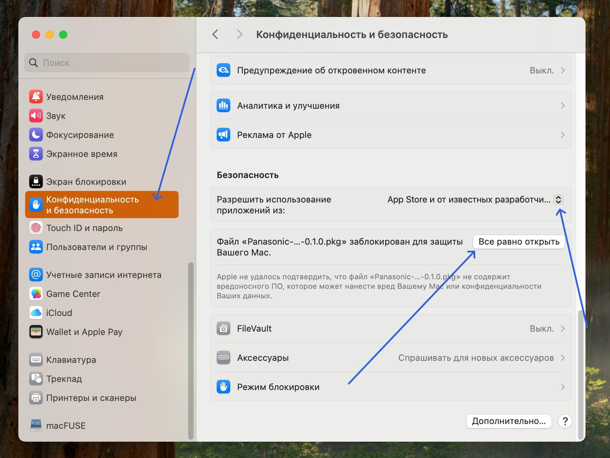
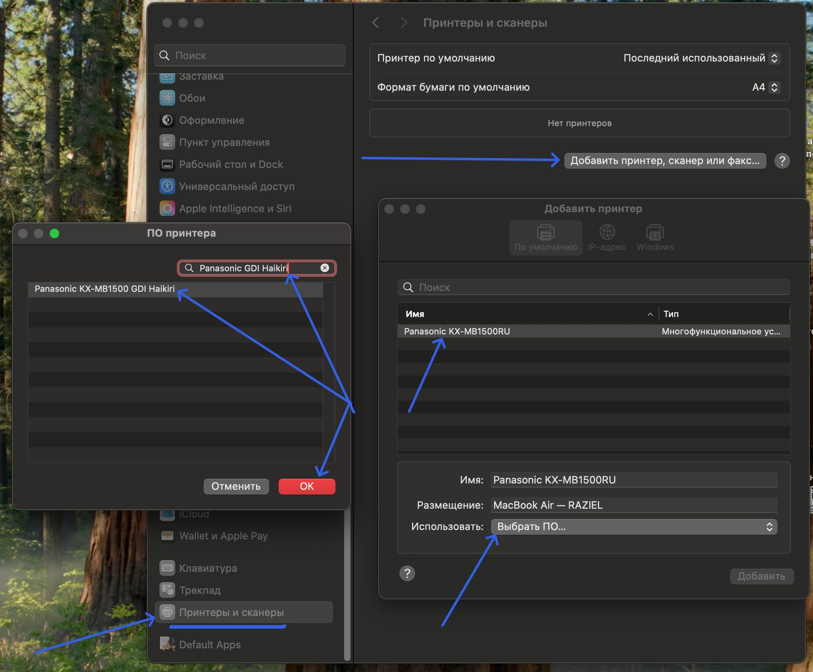

# Драйвер принтера Panasonic KX-MB1500 для macOS (`x86_64` + `arm64`)

Это неофициальный драйвер печати для серии принтера `Panasonic KX-MB1500`.

Печать здесь сделана своим CUPS-фильтром на исходниках линукса, нейро-слопом.
Драйвер печати собран как universal пакет и работает как на `Intel` так и на `Apple Silicon`.

## Только печать

Если нужна только печать:

1. Подключи принтер по USB.
2. Скачай наш [.pkg из последнего релиза](https://github.com/MKC-MKC/driver-panasonic-kx-mb1500-macos/releases/latest).
3. Откройте пакет.
4. Сработает защита macOS от непроверенных разработчиков.
5. Открой настройки Mac.
   
6. Конфиденциальность и безопасность.
7. Прокрути в самый низ, найди кнопку "Все равно открыть".
8. Проводи обычную установку драйвера. (macOS может запросить пароль).
9. Открой в настройках "Принтеры и сканеры" (в самом низу).
   
10. Нажми "Добавить принтер, сканер или факс..."
11. В списке появится принтер. Выбери его.
12. Снизу будет "Имя", "Размещение", "Использовать": Выбери в "Использовать:" "Выбрать ПО...".
13. Вверху будет поиск по фильтру. Напиши `Panasonic GDI` или `Haikiri`.
14. Выбери драйвер, далее "ОК", потом "Добавить".
15. Если принтер пишет "ПК печатает", нажми "STOP".
16. Перезагрузи принтер.
17. Готово.

## Печать и сканер

Для сканирования нужен старый официальный Panasonic backend app.
На `Apple Silicon` он работает только через `Rosetta`!

Официальные ссылки Panasonic:

- [Mac_1.15.2.dmg](https://www.psn-web.net/cs/support/fax/common/file/Mac_Installer/Mac_1.15.2.dmg)
- [Страница драйвера](https://docs.connect.panasonic.com/pcc/support/fax/common/table/macdriver.html)

Копию живого файла приложил в артефакты, если источник вдруг станет недоступен.

Алкоритм установки:

1. Подкинь принтер по USB.
2. Скачай и установи `Mac_1.15.2.dmg`.
3. После установки потребует перезагрузку.
4. Если у вас `Apple Silicon`, установите `Rosetta`.
5. После этого [скачайте наш .pkg из релизов проекта](https://github.com/MKC-MKC/driver-panasonic-kx-mb1500-macos/releases/latest).
6. Да, реально, [ещё раз переустанови наш драйвер pkg](https://github.com/MKC-MKC/driver-panasonic-kx-mb1500-macos/releases/latest), даже если уже ставил его!
7. Если принтер пишет "ПК печатает", нажми "STOP".
8. Перезагрузи принтер.
9. Готово:
10. Откройте приложение `Захват изображений` и проверяй свой сканер.
